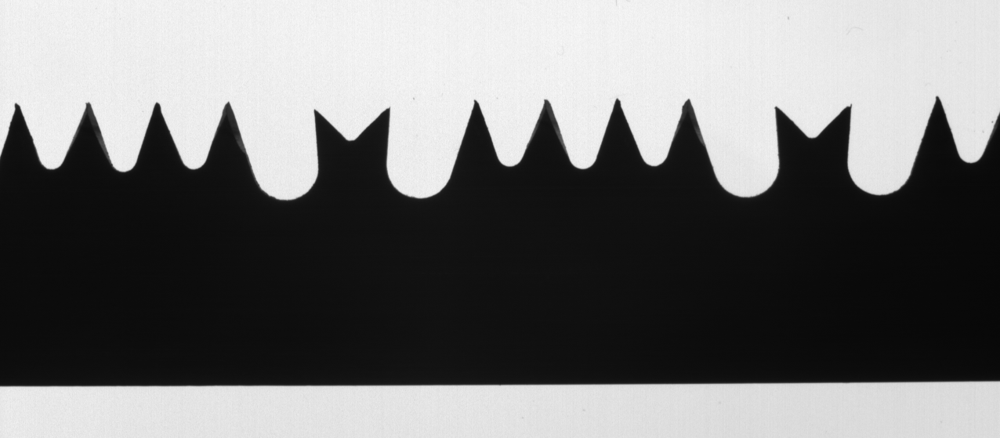
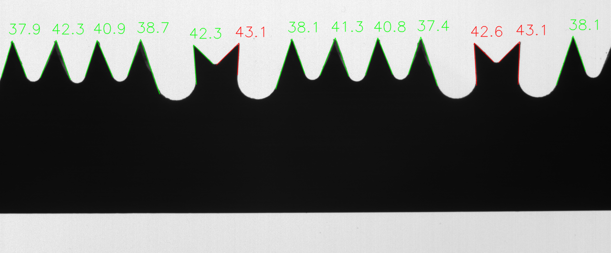
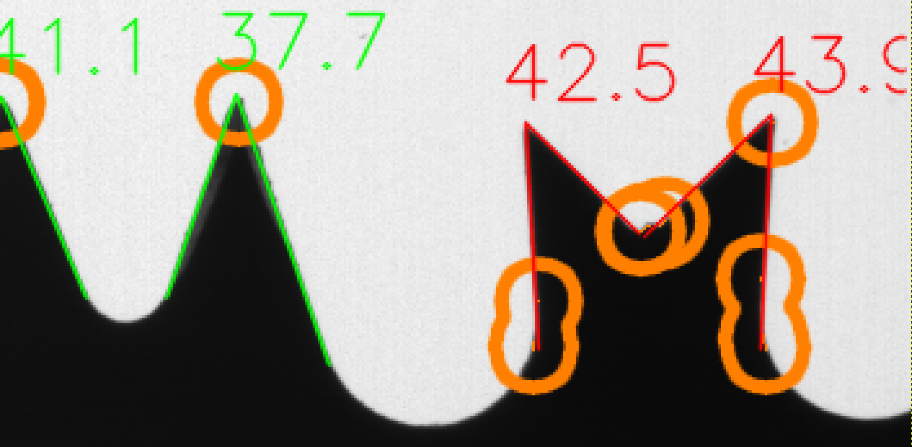

# Computer Vision and Image Processing M Project
# Visual Inspection of Blade Tools

## The task
In this project the task is to quality check a saw blade by measuring the angle of the teeth.

<!-- Example of input image:
 --->

Inspection results are overlaid into the image:

An optional burr detection can also be carried out:

More information on the task to be carried out in the [attached pdf](Visual%20Inspection%20of%20Blade%20Tools%20Project.pdf)

## The solution
All the code, explained step by step, in [this jupyter notebook](Main.ipynb) (Main.ipynb file in the project root).

## Run the code
To run the notebook, without needeing to install the specific version of the libraries, you can run the project in a docker container.

Open a shell in the project directory, then:

`docker build -f Docker/Dockerfile --tag cvlab:latest .`

`docker run -d --net=host --name cvlab -v "$PWD":/home/cvlab -p 8888:8888 cvlab:latest`

Get the link (with the access token included in the url) by looking at jupyter notebook ouput:

`docker logs cvlab`